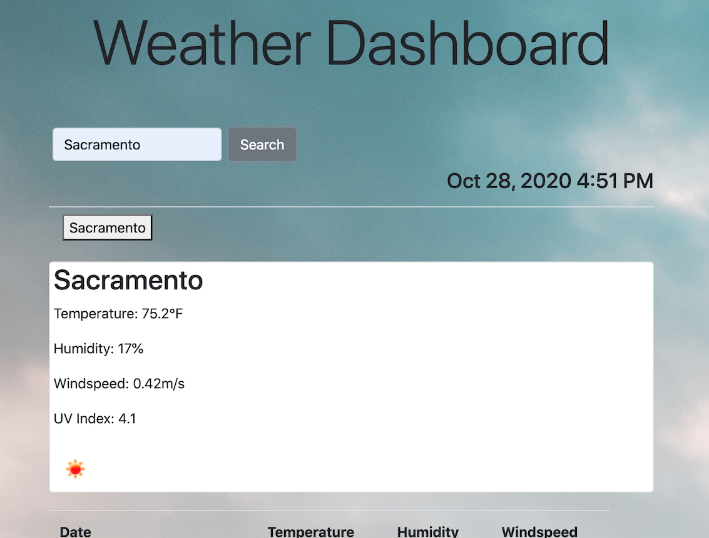

# Weather Dashboard
Weather application that retrieves data using another application's API.

## Description

The purpose of this exercise was to dynamically update HTML and CSS by retrieving data from another application's API.  For this particular assignment data was retrieved from OpenWeather API to retrieve the current and 5 day forecast containing temperature, humidity, windspeed, and UV index of a given city. Technologies used include HTML, CSS, JavaScript, Moment.js, Bootstrap and Google Fonts.

## Installation  

Access the Weather Dashboard [here.](https://lee-amber-alex.github.io/Weather.Dashboard/)  
Access the Weather Dashboard Repository [here.](https://github.com/lee-amber-alex/Weather.Dashboard)  

## Usage  

### Home Screen:  

  

### City Search:  

   

  

 

### Saved Search:  

  

  

### Credits  

Background images obtained from [freepik](http://www.freepik.com).  

### Contact Me  
 
Amber Alex Lee
- [Email](lee.amber.alex@gmail.com)
- [Github Page](https://github.com/lee-amber-alex)
- [LinkedIn](www.linkedin.com/in/leeamberalex)

